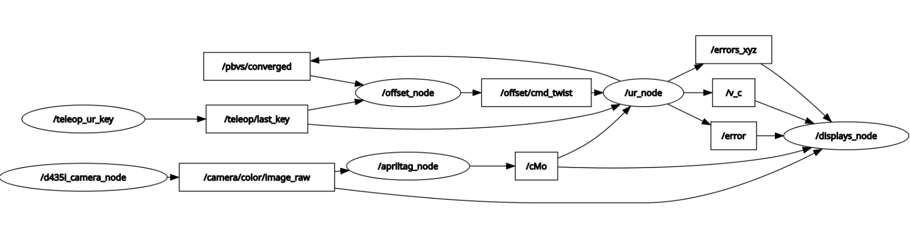

# Robot Alignment at Fermilab National Laboratory
Autonomous Alignment of SRF coupler flange to cavity flange using Universal Robots E-Series Cobot. Package built in the ROS2 framework. Eye-in-Hand camera. 


# Robot Alignment Workspace

ROS 2 workspace for eye-in-hand visual servoing with a Universal Robots e-Series arm and an Intel RealSense D435i camera. The primary package in the current codebase is `uralignment_cpp`, which performs:

- Real-time RGB image acquisition from a D435i
- AprilTag-based target pose estimation
- Position-Based Visual Servoing (PBVS) with ViSP
- Keyboard-gated robot motion
- Optional force-based axial approach after PBVS to close the offset distance
- Live visualization of camera images, pose, error, and camera frame velocity

The package is designed around alignment to a four-tag target and a UR robot running in velocity control. `ur_alignment_ws` uses a method of markerless object detection, which will be migrated to `uralignment_py` and changed from a stand-alone version of the alignment to a object detection node written in Python and run using Docker.

## What the system does

The runtime pipeline is:

1. `d435i_camera` publishes RGB images from the RealSense camera.
2. `apriltags` subscribes to the image stream, detects the tag rig, and publishes `cMo`.
3. `ur_e_series` subscribes to `cMo`, loads the desired pose from `cdPo.yaml`, and computes PBVS camera-frame velocity commands.
4. `teleop_key` gates motion so the robot only moves when commanded from the keyboard.
5. `displays` visualizes the image stream, detected pose, PBVS error, and commanded twist.
6. `offset` can optionally take over after PBVS convergence and command a slow tooling-frame approach based on force feedback.

## Core executables

The following executables are the core runtime path for alignment.

| Executable | Role |
|---|---|
| `d435i_camera` | Publishes `/camera/color/image_raw` from the RealSense D435i and writes `active_camera.yaml` to workspace/package config locations. |
| `apriltags` | Subscribes to the camera image, loads intrinsics, detects the AprilTag rig, and publishes the fused pose as `cMo`. |
| `ur_e_series` | Loads `ur_eMc.yaml` and `cdPo.yaml`, runs PBVS, publishes `v_c`, `error`, `errors_xyz`, and drives the UR robot. |
| `teleop_key` | Publishes the most recent control key on `/teleop/last_key` with transient local QoS. |
| `displays` | Visualizes the image stream and control state, and can save the current pose as `cdPo.yaml`. |
| `offset` | Waits for PBVS convergence, measures TCP force through RTDE, and commands a slow axial approach on `/offset/cmd_twist_cf`. |

## Additional executable in the package

- `tracker`records topic publication rate for the main PBVS pipeline (image, object, velocity), camera frame velocity, and error. PNGs of the plots over time are generated and saved to the `data` directory.


## Node Structure




## Assumptions and hardware expectations

This package assumes the following kind of setup:

- Intel RealSense D435i connected and accessible through librealsense2
- Universal Robots e-Series robot reachable over Ethernet
- UR robot configured for remote velocity control
- Eye-in-hand camera mounting with a valid `ur_eMc.yaml`
- A four-AprilTag target arrangement consistent with the `apriltags` node parameters
- A valid intrinsics YAML matching the active camera serial number and stream resolution


## Build

From the workspace root:

```bash
colcon build --packages-select uralignment_cpp
source install/setup.bash
```

## Recommended runtime sequence

Open separate terminals, source the workspace in each terminal, then launch the nodes in this order.

### 1) Camera

```bash
ros2 run uralignment_cpp d435i_camera
```

### 2) AprilTag pose estimation

```bash
ros2 run uralignment_cpp apriltags
```

### 3) Visualization

```bash
ros2 run uralignment_cpp displays
```

### 4) Keyboard control

```bash
ros2 run uralignment_cpp teleop_key
```

### 5) PBVS robot controller

```bash
ros2 run uralignment_cpp ur_e_series
```

### 6) Optional force-based offset closure

```bash
ros2 run uralignment_cpp offset
```

## Keyboard controls

`teleop_key` publishes the latest key state rather than a momentary command.

| Key | Effect |
|---|---|
| `X` or `x` | Start or enable alignment |
| `Space` | Stop alignment |
| `Q`, `q`, or `Esc` | Quit |


### After convergence

- If `offset` is not running, the node holds zero velocity.
- If `offset` is running and sending fresh commands, `ur_e_series` switches to the incoming post-convergence twist.
- In that post-convergence mode, velocity is applied in the **end-effector frame**.

## Offset node behavior

Its sequence is:

1. Wait for `/pbvs/converged = true`
2. Wait for valid RTDE wrench data
3. Capture a short stationary force baseline
4. Enter a slow approach along `tooling_frame` +Z
5. Stop when force magnitude exceeds baseline plus the configured contact threshold for enough consecutive samples


# Acknowledgment
**Nickolas Giffen**
  - Northern Illinois University
  - nickolas.giffen@outlook.com
    
**Andrea Vivai**
  - University of Pisa
  - a.vivai@studenti.unipi.it
    
**Alessandro Ciaramella**
  - University of Pisa
  - a.ciaramella@tii.ae
