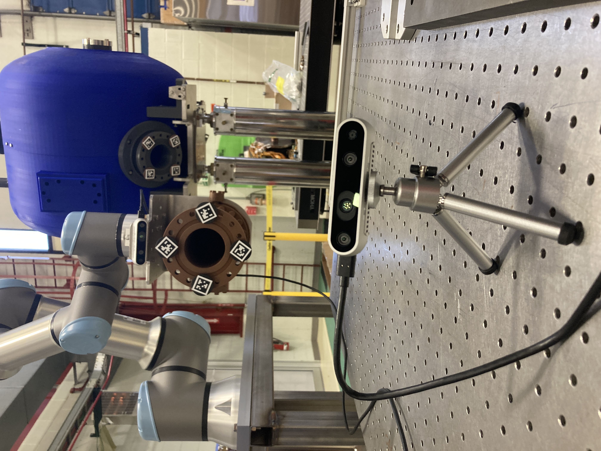
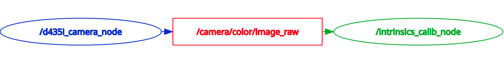
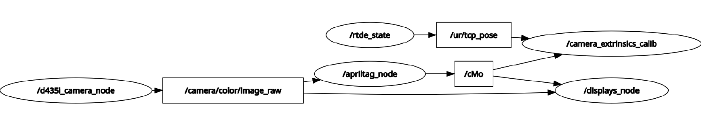
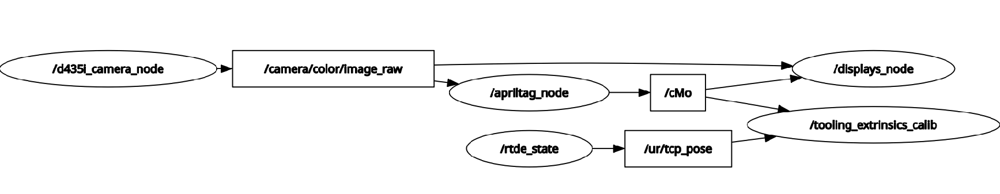

# calibration_cpp

`calibration_cpp` is the ROS 2 package that supports the calibration side of the Robot-Alignment workspace. The package is built around three main calibration tasks:

1. camera intrinsics calibration,
2. camera extrinsics calibration (`eMc`, saved as `ePc.yaml`), and
3. tooling extrinsics calibration (`eMt`, saved as `ePt.yaml`, with `cPt.yaml` derived afterward).

The package also includes support nodes for AprilTag pose generation, UR RTDE pose readback, and optional visualization utilities.





---

## What the package does

The package provides everything needed to:

- estimate camera intrinsics from a chessboard dataset,
- publish the robot TCP pose from a UR controller over RTDE,
- estimate the target pose seen by the camera from AprilTags,
- solve hand-eye style calibration problems from captured robot/camera pose pairs,
- write calibration YAML files into mirrored config locations used by the rest of the workspace.

The package expects a broader calibration stack around it:

- an image publisher on `/camera/color/image_raw`,
- an AprilTag target that produces `cMo`,
- a UR robot reachable over RTDE for `/ur/tcp_pose`,
- shared config locations across `calibration_cpp`, `uralignment_cpp`, and `uralignment_py`.

---

## Main executables

### 1) `intrinsics_calib`
Interactive GUI-based checkerboard calibration node.

Purpose:
- subscribes to a live camera image,
- detects a chessboard,
- captures image/corner samples on demand,
- solves intrinsics with OpenCV,
- writes the intrinsics YAML,
- optionally writes a full quality-report bundle.

Default assumptions in the current source:
- image topic: `/camera/color/image_raw`
- board size: `24 x 17` inner corners
- square size: `0.0075 m`

Keyboard controls inside the OpenCV window:
- `c` = capture current frame
- `s` = solve and save
- `r` = reset dataset
- `q` or `Esc` = quit

Main outputs:
- `<serial>_<width>x<height>_intrinsics.yaml`
- a session bundle under `src/calibration_cpp/data/<timestamped_session_dir>/` containing:
  - `01_uncorrected_with_lines/`
  - `02_corner_detection/`
  - `03_corrected_image/`
  - a copy of the intrinsics YAML
  - `calibration_quality_report.md`

Use this node to generate or regenerate camera intrinsics for a specific camera serial number and resolution.




---

### 2) `camera_extrinsics_calib`
Interactive camera extrinsics solver.

Purpose:
- subscribes to the robot pose topic (`/ur/tcp_pose` by default),
- subscribes to the tag pose topic (`cMo` by default),
- waits for a fresh tag pose after each keypress,
- pairs that tag pose with the nearest robot RTDE sample in the buffer,
- builds consecutive motion pairs,
- solves the `A X = X B` problem for `X = eMc`,
- writes the result as `ePc.yaml`.

Important behavior:
- samples are captured manually,
- nearest-neighbor timestamp pairing is used between the tag measurement and buffered RTDE poses,
- samples are rejected if the nearest robot sample is too old relative to the tag timestamp,
- the node computes residual statistics and prints a simple PASS/FAIL flag.

Keyboard controls in the terminal:
- `c` = capture sample
- `x` = compute and save calibration, then exit
- `q` or `Esc` = cancel without saving

Main output:
- `ePc.yaml`

Use this node to estimate the transform from the UR end-effector frame to the camera frame.




---

### 3) `tooling_extrinsics_calib`
Interactive tooling extrinsics solver.

Purpose:
- captures paired robot/tag samples in the same style as `camera_extrinsics_calib`,
- solves for tooling extrinsics `eMt`,
- writes `ePt.yaml`,
- then reads `ePc.yaml` and derives `cPt.yaml` as:

```text
cMt = inv(eMc) * eMt
```

Keyboard controls in the terminal:
- `c` = capture sample
- `x` = compute and save calibration, then exit
- `q` or `Esc` = cancel without saving

Main outputs:
- `ePt.yaml`
- `cPt.yaml`

Important note:
- `camera_extrinsics_calib` should be run first, because `tooling_extrinsics_calib` needs `ePc.yaml` in order to derive `cPt.yaml`.




---

## Support executables

### `rtde_state`
Publishes the current UR TCP pose to `/ur/tcp_pose`.

Purpose:
- connects to the UR controller using `ur_rtde::RTDEReceiveInterface`,
- reads `getActualTCPPose()`,
- converts the UR rotation-vector pose into a quaternion pose message,
- publishes `geometry_msgs::msg::PoseStamped`.

Default parameters:
- `robot_ip = 192.168.1.101`
- `rate_hz = 125.0`
- `frame_id = inertial`

Use this node whenever the extrinsic calibration nodes need live robot pose data.

---

### `apriltag_node`
Use this node instead of `apriltags_node` from `uralignment_cpp` package when using one AprilTag instead of 4 radially placed about a concentric center.

Publishes the target pose seen by the camera on `cMo`.

Purpose:
- subscribes to `/camera/color/image_raw`,
- loads the active camera selection and matching intrinsics YAML,
- runs ViSP AprilTag detection,
- computes a fused target pose from the detected tags,
- publishes `geometry_msgs::msg::TransformStamped` on `cMo`.

Important note:
- this node expects `active_camera.yaml` and a matching intrinsics YAML to already exist in the mirrored config locations.

---

### `displays_node`
"Optional" visualization and inspection node. It would behoove you to visually inspect the camera view of the target before capture.

Purpose:
- subscribes to live image, `cMo`, velocity, and error topics,
- plots visual-feature error and camera velocity traces,
- overlays pose information,
- can capture the current `cMo` as `cdPo.yaml` from the display window.


---

## Internal helper files

### `transform_math.*`
Math utilities for converting between ROS messages, pose vectors, and homogeneous transforms, as well as solving and evaluating the `A X = X B` problem.

### `yaml_io.*`
Helpers for:
- finding mirrored config directories,
- reading and writing 6-DOF pose YAML files,
- writing intrinsics YAML files,
- writing to both install-space and source-space mirrors.

### `terminal_io.*`
Terminal raw-mode helpers used by the two interactive extrinsics nodes.


---

## Expected config files

The package reads or writes several workspace-shared files.

### Produced by calibration nodes
- `ePc.yaml` — camera extrinsics result
- `ePt.yaml` — tooling extrinsics result
- `cPt.yaml` — tooling pose expressed in the camera frame
- `<serial>_<width>x<height>_intrinsics.yaml` — per-camera, per-resolution intrinsics file

### Consumed by calibration nodes
- `active_camera.yaml` — tells the stack which camera serial number and resolution are active
- `cdPo.yaml` — desired pose file used elsewhere in the workspace
- legacy `ur_cdMo.yaml` — older desired-pose filename that can be mirrored/converted

The package is designed to mirror files across config locations for:
- `calibration_cpp`
- `uralignment_cpp`
- `uralignment_py`

That mirroring is intentional so downstream nodes can find the same calibration outputs without manual duplication.

---

## Topics used by the package

### Inputs
- `/camera/color/image_raw`
- `cMo`
- `/ur/tcp_pose`

### Outputs
- `cMo` (from `apriltag_node`)
- `/ur/tcp_pose` (from `rtde_state`)

Optional debug/visualization topics used by `displays_node` may include:
- `v_c`
- `error`
- `errors_xyz`

---

## Typical workflow

### Build

From the workspace root:

```bash
colcon build --packages-select calibration_cpp
source install/setup.bash
```

Because the package uses ROS 2, OpenCV, `cv_bridge`, ViSP, Eigen, and UR RTDE interfaces, make sure those dependencies are installed and discoverable in the workspace before building.

---

### 1) Intrinsics calibration

Start the image publisher first, then run:

```bash
ros2 run calibration_cpp intrinsics_calib
```

Procedure:
1. Move the checkerboard through varied positions and orientations.
2. Press `c` to capture good detections.
3. Repeat until the dataset is sufficiently rich.
4. Press `s` to solve and write the intrinsics YAML.
5. Review the saved report bundle and validation images.

---

### 2) Camera extrinsics calibration

Start the required upstream publishers first:

- image publisher on `/camera/color/image_raw`
- `apriltag_node`
- `rtde_state`

Then run:

```bash
ros2 run calibration_cpp camera_extrinsics_calib
```

Procedure:
1. Move the robot/camera through multiple distinct poses while keeping the target observable.
2. Press `c` to capture paired robot/tag samples.
3. Continue until enough diverse samples are collected.
4. Press `x` to solve and save `ePc.yaml`.

---

### 3) Tooling extrinsics calibration

Run the same upstream publishers used for camera extrinsics, then run:

```bash
ros2 run calibration_cpp tooling_extrinsics_calib
```

Procedure:
1. Capture multiple paired samples.
2. Press `x` to solve.
3. Confirm that `ePt.yaml` is written.
4. Confirm that `cPt.yaml` is derived from the saved `ePc.yaml`.

---

## Practical notes

- `intrinsics_calib` needs a real display and keyboard focus because it uses an OpenCV GUI window.
- `camera_extrinsics_calib` and `tooling_extrinsics_calib` need to run in a real terminal because they switch STDIN into raw mode for keyboard capture.
- The extrinsics nodes require at least three captured samples before solving, but more diverse samples are strongly preferred.
- The quality of `cMo` directly affects the quality of the extrinsic result.
- The tooling extrinsics node should normally be treated as a downstream step that depends on a trustworthy `ePc.yaml`.

---

## Package role in the larger workspace

`calibration_cpp` is the package that creates the calibration files used by the downstream alignment and servoing stack.

In particular, other workspace components depend on this package to produce:
- camera intrinsics,
- camera extrinsics (`ePc.yaml`),
- tooling extrinsics (`ePt.yaml`),
- derived camera-to-tooling pose (`cPt.yaml`).

If those files are missing, stale, or inconsistent across mirrored config locations, downstream alignment behavior will also be inconsistent.

---


# Acknowledgment
**Nickolas Giffen**
  - Northern Illinois University
  - nickolas.giffen@outlook.com
    
